# [Langkah-Langkah Instalasi Linux Ubuntu 24.04]

Ahmad Farrel Aly
09011282328045
SK3C
Praktikum Sistem Operasi
1.	Buatlah laporan proses instalasi di computer mahasiswa dan tampilkan screenshotnya.
Langkah-Langkah Instalasi Sistem Operasi Linux Ubuntu 

1.	Kunjungi situs https://ubuntu.com/download/desktop untuk mengunduh ISO Linux Ubuntu 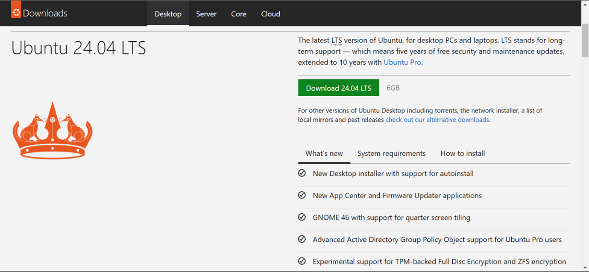
2.	Kemudian kunjungi https://www.virtualbox.org/wiki/Downloads untuk mengunduh Virtual Box 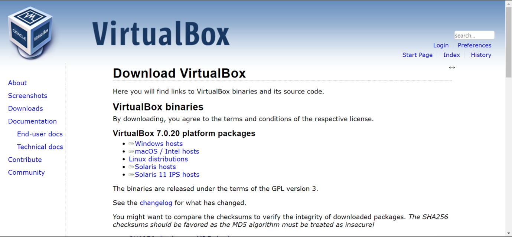
3.	Setelah itu, lakukan instalasi pada Virtual Box dan buka aplikasinya
4.	Klik New untuk membuat Virtual Machine Baru 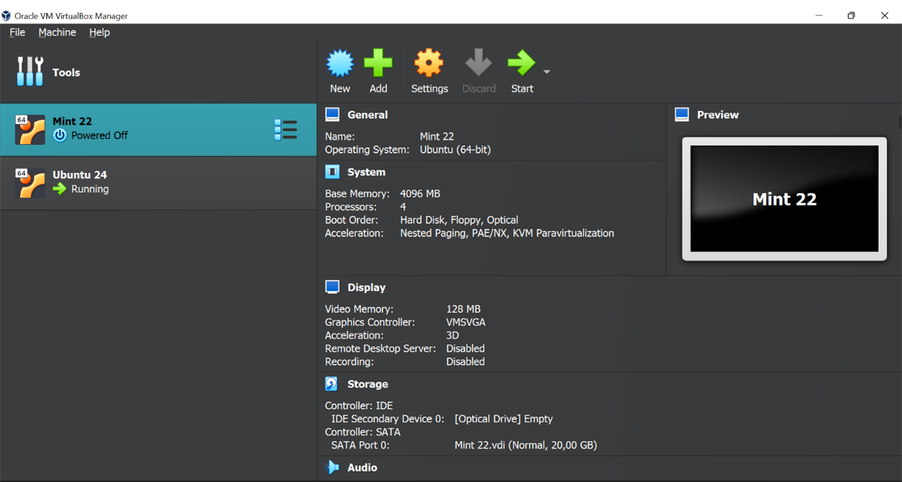
5.	Lalu isi Nama, pilih tempat penyimpanan, pilih ISO Linux Ubuntu yang telah diunduh dan centang pada bagian “Skip Unattended Installation” 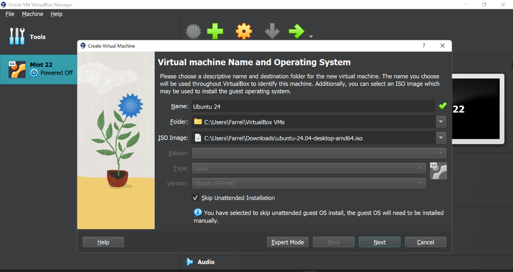
6.	Kemudian atur kapasitas RAM dan Core pada Processor, sesuaikan dengan kemampuan Laptop/PC 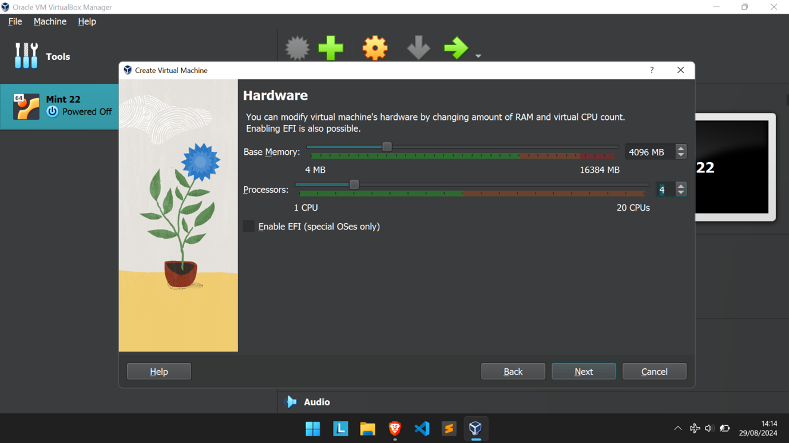
7.	Lalu Atur Kapasitas Virtual Hard Disk (Sesuaikan dengan sisa penyimpanan pada HDD/SSD 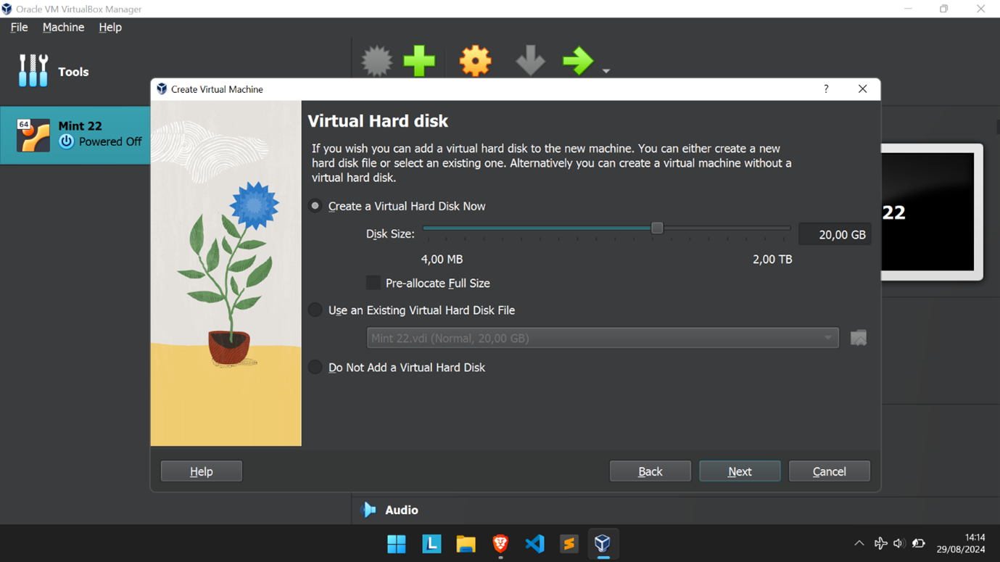
8.	Kemudian klik “Finish” 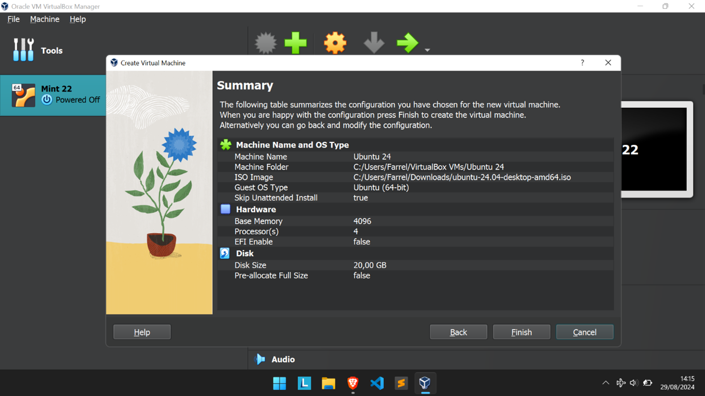
9.	Lalu buka Settings, pada bagian System – Motherboard, ubah boot order pada hard disk menjadi paling atas 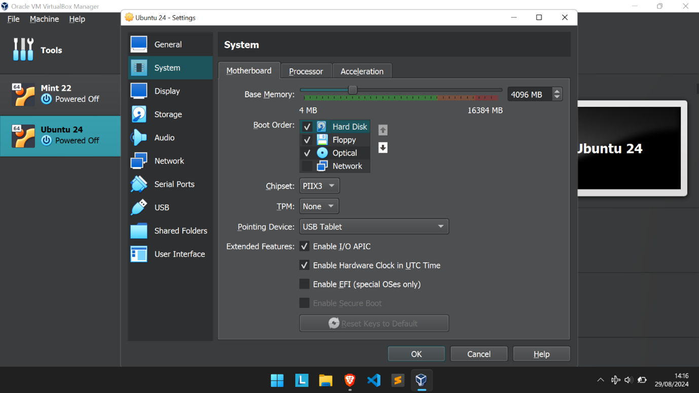
10.	Pada bagian Processor, Centang Enable PAE/NX 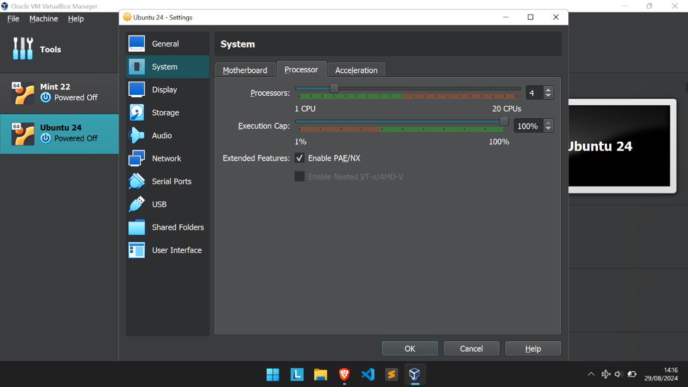
11.	Pada bagian Display – Screen set video memory maksimum 128 mb 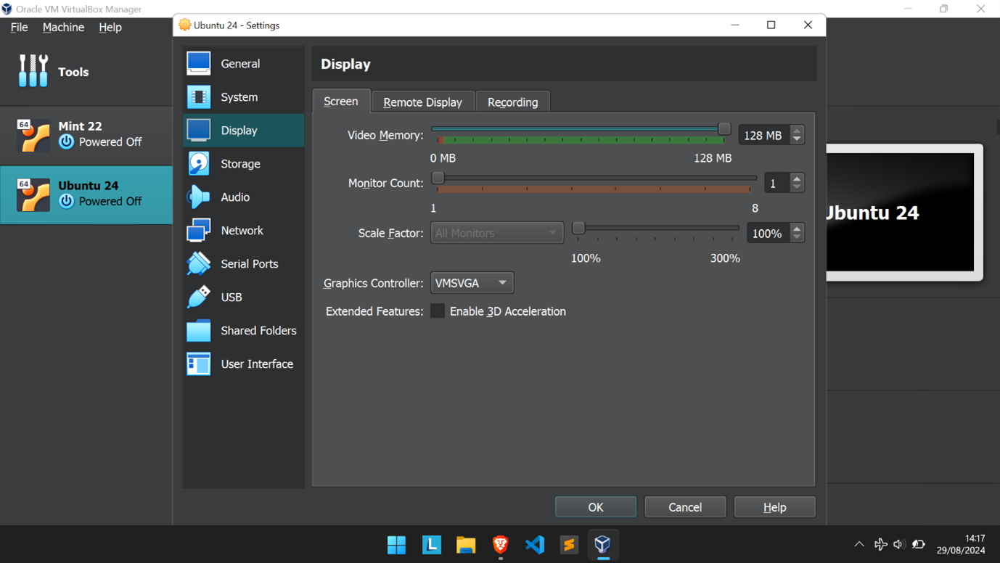
12.	Lalu klik ok kemudian klik start 
13.	Pada bagian “Try Or Install Ubuntu” tekan Enter 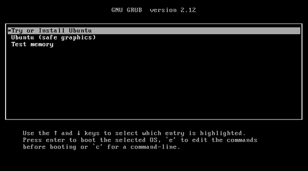
14.	Atur Keyboard Layout Lalu Klik next 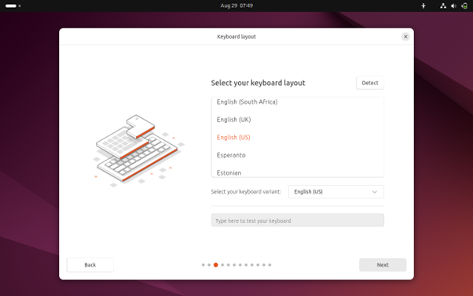
15.	Atur Aksesibilitas bila diperlukan 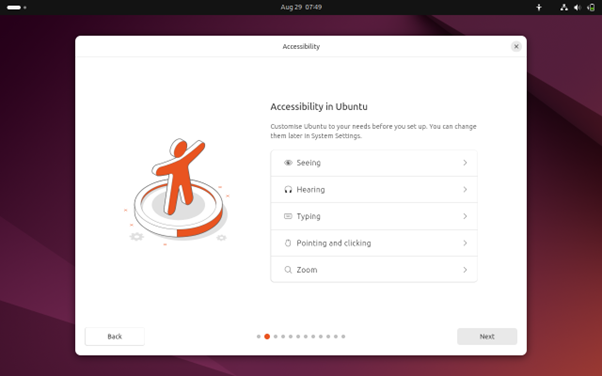
16.	Pilih Layout Keyboard, umumnya English 
17.	Klik Use Wired Connection dan Next 
18.	Klik Skip untuk melewati update installer 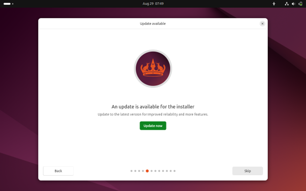
19.	Klik Install Ubuntu dan Next 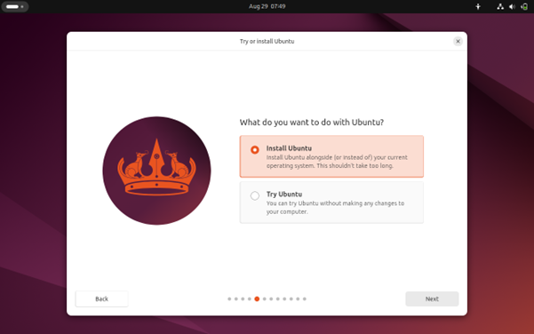
20.	Pilih Interactive Installation dan Next 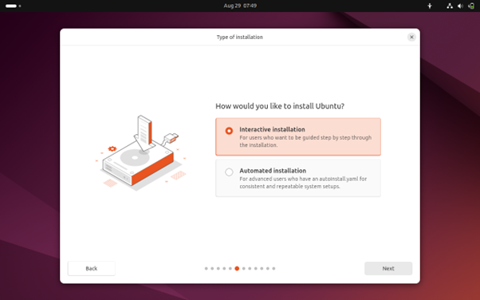
21.	Pilih Install Ubuntu lalu pilih next 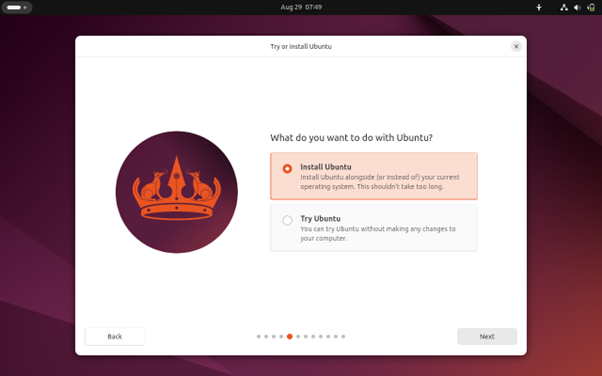
22.	Pilih Default selection dan pilih next 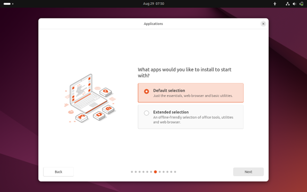
23.	Centang 2 kotak tersebut dan next 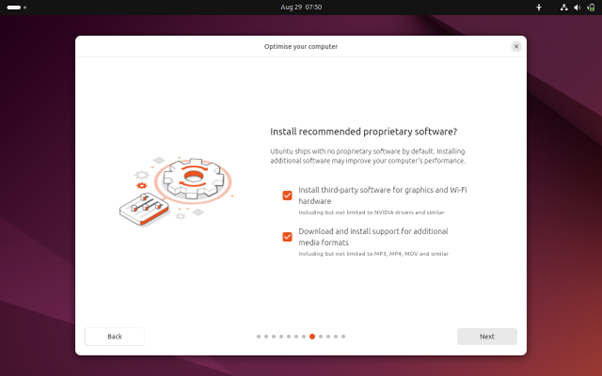
24.	Pilih Erase disk and Install Ubuntu Kemudian klik Next 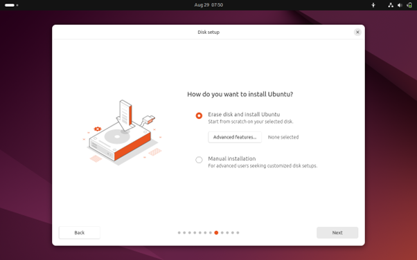
25.	Buat Akun dan atur Password (bila diperlukan) 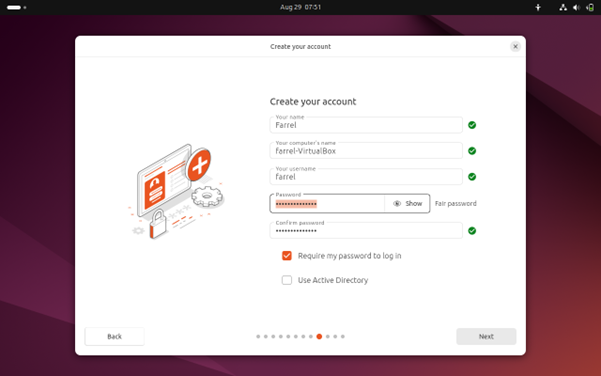
26.	Pilih Region dan Zona Waktu tempat tinggal 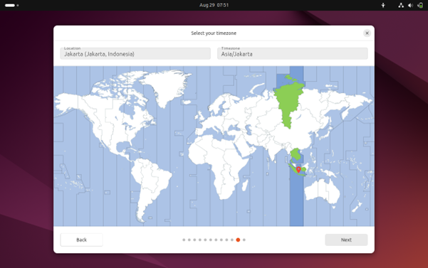
27.	Klik Install dan tunggu proses Instalasinya hingga selesai 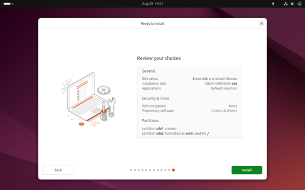
28.	Jika Instalasi sudah selesai, Klik Restart Now 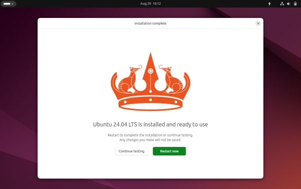
29.	Lalu tekan Enter jika muncul tulisan seperti ini 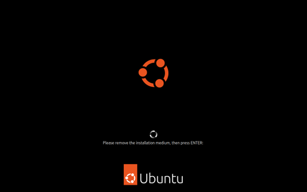
30.	Pilih akun dan masukkan Password 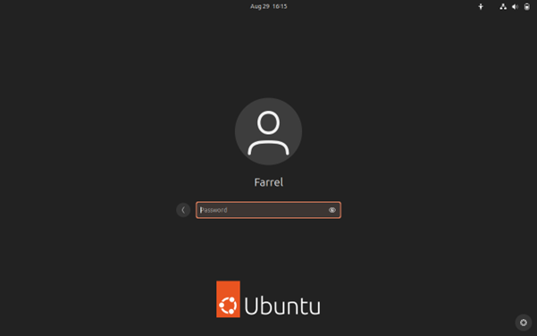
31.	Proses Instalasi Linux telah Selesai 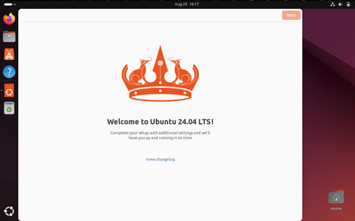

2.	Analisislah pada gambar kenapa saat instalasi perlu dipilih “/” pada opsi Mount Point? 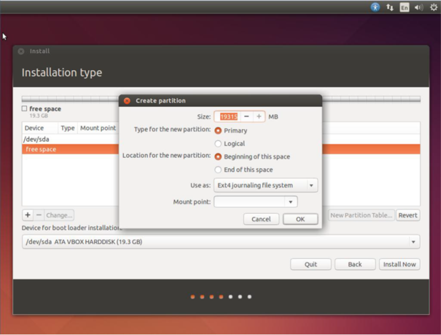
Jawab:
Saat Instalasi kita perlu memilih “/” pada opsi Mount Point dikarenakan “/” merupakan bagian sistem yang disebut dengan root atau akar dari keseluruhan dimana file sistem dan kernel disimpan, tanpa partisi root, sistem operasi tidak akan mempunyai tempat untuk menyimpan file sistem dan kernelnya yang tentunya sistem operasi tidak akan berjalan alias tidak berfungsi.
3.	Berikan penjelasan tentang ext4, ext3, swap, ntfs, fat32,btrfs !
Jawab:
Ext4, atau fouth extended FileSystem merupakan sebuah file sistem yang biasanya digunakan pada Sistem Operasi Linux, ext4 merupakan penerus dari ext3 yang memiliki fitur alokasi yang lebih cepat serta support volume penyimpanan yang lebih besar (hingga 1 exabyte), memiliki fitur journaling yang berfungsi memulihkan file sistem jika terjadi kegagalan atau kerusakan. 
Ext3 atau third extended filesystem juga merupakan sebuah file sistem yang digunakan pada sistem operasi Linux. Mendukung ukuran file hingga 2 terabyte dan ukuran partisi hingga 32 terabyte. Juga memiliki fitur journaling yang berfungsi untuk recovery file sistem jika terjadi kegagalan. 
Swap merupakan sebuah partisi yang berfungsi menyediakan ruang memori tambahan ketika physical memory (RAM Fisik) penuh. Swap berfungsi untuk membantu meningkatkan kinerja sistem dengan memungkinkan penggunaan memori yang lebih fleksibel. Swap bekerja dengan cara ketika RAM fisik penuh, Sistem Operasi akan memindahkan data yang tidak sedang digunakan ke hard disk.
NTFS (New Technology File System) merupakan sebuah file sistem yang digunakan pada sistem operasi Windows yang mulai digunakan dari Windows 3.1 hingga Windows 11 sekarang oleh Microsoft Corporation. NTFS mendukung ukuran file yang besar serta memiliki kecepatan baca dan tulis yang lebih cepat daripada file sistem Fat32. NTFS memiliki fitur enkripsi serta pengaturan akses pada izin file yang memungkinkan administrator menentukan user yang berhak mengakses suatu file. 
FAT32 atau File Allocation Table 32 merupakan file sistem berkas yang dikembangkan oleh Microsoft Corporation untuk menggantikan sistem FAT16 yang mengalami banyak keterbatasan. FAT32 umum digunakan pada flash drive, kamera, kartu memori, dll. FAT32 mendukung ukuran file hingga 4 GB.
 Btrfs (B-Tree File System) merupakan file sistem modern yang dibuat oleh Oracle untuk mengatasi berbagai keterbatasan pada file sistem sebelumnya seperti ext4 dengan berbagai fitur yang dapat meningkatkan fleksibilitas serta skalabilitas yang luas. Btrfs memiliki berbagai fitur seperti Snapshot, yakni sebuah salinan dari seluruh file sistem yang sangat berguna untuk backup, recovery jika ada kesalahan. Lalu subvolume, yakni bagian terpisah dari file sistem yang dapat dikelola secara independent. Dukungan terhadap RAID, yakni memungkinkan pengguna untuk membuat sistem yang lebih tahan terhadap error.

